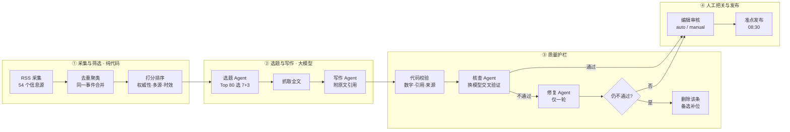
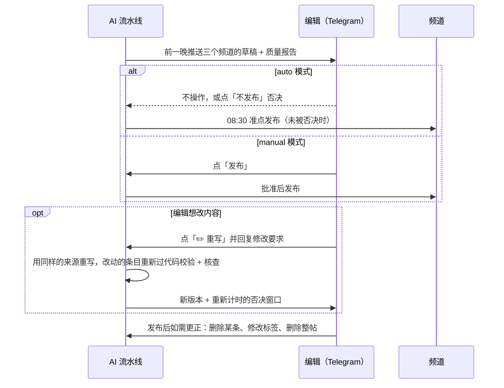

<div align="center">


# Fintech Daily · AI 新闻智能体

**每天早上 8:30，用三种语言为金融科技从业者送上 7 条经过事实核查的行业要闻**

独立借助 AI 编程工具，从 0 到 1 设计、上线并持续运营的 AI 内容产品

[](https://github.com/aliyabb/fintech-daily-ai-agent/actions/workflows/tests.yml)


**在线频道** &nbsp;·&nbsp; [🇨🇳 中文 @fintech_daily_zh](https://t.me/fintech_daily_zh) &nbsp;·&nbsp; [🇬🇧 English @fintech_daily](https://t.me/fintech_daily) &nbsp;·&nbsp; [🇷🇺 Русский @fintech_daily_ru](https://t.me/fintech_daily_ru)

**项目一页纸** &nbsp;·&nbsp; [🌐 在线查看](https://aliyabb.github.io/fintech-daily-ai-agent/) &nbsp;·&nbsp; [📄 中文 PDF](docs/one-pager-zh.pdf) &nbsp;·&nbsp; [📄 English PDF](docs/one-pager-en.pdf)

</div>

---

## 项目概览

| | |
|---|---|
| **产品** | 自动化金融科技新闻简报：从 54 个信息源采集 → 去重排序 → AI 选题与写作 → 多层事实核查 → 人工审核 → 准点发布 |
| **用户** | 中文、英文、俄文三个市场的金融科技从业者：产品经理、分析师、创业者、投资人 |
| **我的角色** | 产品负责人，独立完成：产品定义、需求与验收标准、架构取舍、质量体系、上线运营与迭代复盘 |
| **开发方式** | AI-native：以 Claude Code 作为 AI 编程工具，我主导产品定义、方案决策、验收与迭代（[详见下文](#-ai-native-工作方式)） |
| **周期** | 2026-09-16 首次提交，09-17 首发上线，至今每日稳定运行 |

## 📊 核心数据

> 统计区间：2026-09-25 至 2026-10-09（3 个频道 × 15 天 = 45 期）。数据来自机器人自己保存的每期草稿与运行记录，计算方法见 [docs/metrics.md](docs/metrics.md)。

<table>
<tr>
<td align="center"><b>45 / 45</b><br><sub>期按时发布，零缺刊</sub></td>
<td align="center"><b>33 / 33</b><br><sub>期准点到分钟<br>（定时方案上线后）</sub></td>
<td align="center"><b>15%</b><br><sub>的 AI 生成条目<br>在发布前被护栏修正</sub></td>
<td align="center"><b>74%</b><br><sub>的问题由确定性代码<br>而非大模型发现</sub></td>
<td align="center"><b>$0</b><br><sub>月运行成本</sub></td>
</tr>
</table>

| 维度 | 数据 |
|---|---|
| 覆盖 | 3 个频道、3 种语言、54 个 RSS 信息源（11 类，含 13 家金融监管机构） |
| 产出 | 每天每频道 1 期，平均 6.7 条新闻；每周一另发一期「一周回顾」 |
| 质量护栏 | 306 条生成内容中，46 条在发布前被自动修正，5 条被拦下；第二道重复检查上线 3 天拦截 5 条重复新闻 |
| 准点 | 定时方案上线前平均延迟 11.8 分钟，上线后 0 分钟 |
| 工程 | 约 3,500 行 Python 业务代码，113 个单元测试，CI 每次提交自动运行，仅 2 个第三方依赖 |
| 成本 | Gemini 免费层 + GitHub Actions 免费额度（每月约 1,100–1,300 / 2,000 分钟） |

---

## 🎯 要解决的问题

金融科技新闻分散在几十个媒体、通讯和监管机构网站上，而且多为英文。从业者每天需要的是：**3 分钟读完、只看真正重要的事、内容可信**。

人工编辑三种语言的日报成本很高；直接让大模型写新闻又有致命风险：**金融新闻里一个错误的金额、一个被说成"已获批"的"待批准"，就会摧毁读者信任。**

因此产品的核心命题不是"用 AI 写新闻"，而是：

> **如何在零预算下，让一个不稳定、会幻觉的大模型，每天稳定、准时地产出可信的内容？**

由此确定了四个产品原则，后面所有设计都围绕它们展开：

| 原则 | 含义 |
|---|---|
| **可信优先** | 每个事实都必须能在原文中找到；宁可少写一句，也不写错一句 |
| **准时是承诺** | 频道写着 08:30，就必须 08:30 发出 |
| **不重复** | 读者昨天看过的事件，今天不再出现 |
| **零成本可持续** | 免费额度内长期运行，不依赖付费服务器 |

---

## 🏗️ 系统架构：多智能体流水线 + 质量护栏



| 环节 | 实现 | 职责 | 为什么这样设计 |
|---|---|---|---|
| 采集 / 去重 / 排序 | 纯代码 | 从 54 个源抓取 30 小时内新闻，按标题相似度合并同一事件，按来源权重、报道源数量、时效打分，剔除近 10 天已发事件 | 最便宜的环节交给代码：每天几百条原始新闻，只有前 80 条进入大模型 |
| 选题 Agent | Gemini Flash | 选出 7 条 + 3 条备选，标记与历史重复的事件 | 判断"什么重要"需要语义理解 |
| 写作 Agent | Gemini Flash | 基于全文写标题、摘要、"为什么重要"，并附上原文逐字引用 | 引用是后续核查的抓手 |
| 代码校验 | 纯代码 | 每个数字、日期必须出现在引用中；引用必须属于本条新闻的来源 | 确定性、零成本、不会"看走眼" |
| 核查 Agent | 另一个 Gemini 模型 | 逐条核对事实、状态、角色、术语翻译，并检查是否与已发内容重复 | 写和查用不同模型，避免"自己检查自己" |
| 修复 Agent | Gemini Flash | 只修改被指出的问题，一轮为限 | 控制成本与延迟；修不好就删，不硬发 |
| 编辑审核 | Telegram 机器人 | 草稿推送给编辑，可一键否决 | 人对最终发布负责 |

**不同市场的本地化**：三个频道共用一条流水线，但各有语言、受众描述、编辑侧重和信息源权重。例如中文频道提高亚洲信源（新加坡、香港、东南亚等）权重。

---

## ⚖️ 产品取舍：成本 × 速度 × 质量

| 取舍 | 我的选择 | 代价 |
|---|---|---|
| **成本 vs 质量** | 预筛选全部交给代码，大模型只看前 80 条候选；不同步骤分配给不同模型，让每个模型都落在免费额度内 | 代码预筛可能漏掉少数长尾新闻 |
| **速度 vs 质量** | 草稿在前一晚生成，留出重试和人工审核时间；发布时刻只做"发送"这一件事 | 新闻时效最长约 30 小时，牺牲了"实时性" |
| **自动化 vs 风险** | 默认自动发布，但编辑有 20 分钟否决窗口；可切换为必须人工批准 | 编辑需要每天看一眼草稿 |
| **稳定性 vs 质量** | 免费层高峰期模型经常过载：选题环节等待主模型，其余环节允许降级，由护栏兜底质量 | 等待会消耗额度与时间 |
| **功能范围 vs 可信度** | **有意不做长文深度解读。** 数据显示，即使是 280 字以内的短条目，也有 15% 需要在发布前修正；长文包含的事实成倍增加，幻觉风险和核查成本随之上升，在免费模型上无法保证可信度 | 放弃了一个读者可能喜欢的内容形态 |

> 一个关键认知：**在免费层上，模型的可用性是不可控的。** 统计期内 **45 期全部**至少有一个环节由轻量备用模型 Flash Lite 完成，其中 64% 的期次连选题都由它完成。所以质量不能寄托在"用最好的模型"上，而要靠**与模型无关的确定性护栏**。

---

## 🛡️ 幻觉治理：四层护栏

| 层 | 机制 | 拦截什么 |
|---|---|---|
| **1. 有据可依（Grounding）** | 写作基于抓取的原文全文，而不是 RSS 摘要；提示词禁止使用模型自身知识，要求附上逐字引用 | 无中生有、凭记忆补充背景 |
| **2. 确定性校验** | 代码检查每个数字和日期是否出现在引用中、引用来源是否属于本条新闻 | 编造的数字、张冠李戴的来源 |
| **3. 跨模型核查（LLM-as-judge）** | 由另一个模型逐条核对事实、状态（"宣布"≠"完成"，"待批"≠"已批"）、角色（投资方≠所有者）、术语翻译 | 语义层面的细微错误 |
| **4. 人工否决** | 草稿先到编辑手里，可一键阻止发布 | 前三层都没发现的问题 |

**实际效果（45 期、306 条生成内容）：**

- **46 条**在发布前被自动修正，**5 条**修不好被直接删除，由备选新闻补位
- 46 次修正中，**34 次（74%）由代码校验发现**（引用与来源不符 22 次、数字或日期找不到出处 12 次），**12 次由核查模型发现**
- 核查模型发现的典型问题（均为真实案例）：
  - 把 Stripe "支持"某稳定币写成了 Stripe "发行"该稳定币
  - 财报中 "excluding"（不含）被译成"扣除后"，含义相反
  - 信用卡返现：某类别原本就是 6%，被写成"提升至 6%"
  - "低于一百美元的交易"被写成"低于一美元"

> **启示**：最便宜的代码校验拦下了大部分问题，大模型核查负责剩下的"细活"。护栏分层，成本和效果才能兼得。

---

## 🧑‍⚖️ Human-in-the-loop：人对最终发布负责



- **两种模式，一条命令切换**：`/auto` 自动发布 + 否决权；`/manual` 必须人工批准
- **质量报告随草稿一起送达**：哪条被修正、哪条被删除、哪个环节用了备用模型，编辑一眼可见
- **「✏️ 重写」按钮**：编辑用一句话说明要改什么（"删掉第 3 条""第 2 条讲清楚对银行意味着什么"），AI 只能使用原有来源重写；改动后的条目重新经过全部护栏，**没通过的保留原文**，宁可不改也不改错。旧版本在新版本送达前不会发布，每期最多重写 2 次，配额最坏情况有测试覆盖
- **发布后可更正**：从已发布的帖子中删除某条新闻并自动重新编号、更新话题标签，全部通过 Telegram API 完成，保留原有格式

---

## 🧭 关键产品决策

### 1. 用数据决定模型路由，而不是凭直觉

- **背景**：上线后发现同一事件会隔天重复出现。加入"近 10 天发布记忆"并清理历史重复后，一周复查又发现 3 条新的重复。数据显示：**这 3 条全部出现在主模型过载、由轻量模型 Flash Lite 选题的日子**，它对"不要重复"这类指令遵循得更差。
- **选项**：A. 主模型一过载就立即降级（快，但质量差）；B. 所有环节都等待主模型（质量好，但等待本身也消耗免费额度，因为"过载"响应似乎也计入配额）。
- **决策**：**只在选题环节等待主模型，最多 3 轮**，因为选题错误读者直接可见；写作等环节照常降级，由护栏兜底。同时在核查环节增加第二道重复检查。
- **结果**：第二道重复检查上线 3 天内拦截 5 条重复；选题由轻量模型完成的比例从 67% 降至 56%（样本仍小，持续观察）。

### 2. 准时是产品承诺

- **背景**：频道写着"每天 08:30"，实际发布在 08:43 左右，而且每天时间不同。原因是 GitHub Actions 的定时任务会延迟。
- **选项**：A. 把文案改成"每天早上"；B. 做到分钟级准点，但需要更多运行次数。
- **决策**：**选 B。** 改为外部调度器在发布前 1 分钟唤醒机器人，机器人等到整点分钟再发送；所有运行都是幂等的，多唤醒一次也不会重复发帖。决策前先核算了免费额度：每月约 1,100–1,300 / 2,000 分钟，可以承受；同时发现并清理了每月白白消耗约 330 分钟的冗余定时任务。
- **结果**：平均延迟从 11.8 分钟降到 **0 分钟**，此后 33 期全部准点到分钟。

### 3. 给 AI 自主权，但保留人的否决权

- **背景**：完全自动发布节省编辑时间，但 AI 内容一旦出错就是公开事故；完全人工审批又意味着编辑不在线就无法出刊。
- **决策**：设计 **auto / manual 双模式**。auto 模式下草稿提前送达，编辑有 20 分钟否决窗口，不操作则准点发出；manual 模式必须人工批准。配套质量报告和发布后更正工具。
- **价值**：理解 AI 完全自主在生产环境中的风险，并为内部用户（编辑）设计了低成本、可控的安全交互。

### 4. 上线不是终点：发布后复查成为流程

- **背景**：第一次修复重复问题后，测试全部通过，PR 也已合并。
- **决策**：上线一周后对三个频道的全部帖子做一次复查，而不是把"测试通过"当作"问题解决"。
- **结果**：发现了 3 条测试无法覆盖的新重复，并定位到全新的根因（轻量模型的指令遵循问题），进而推动了决策 1。
- **原则**：在 LLM 系统中，"测试通过"不等于"线上正常"，必须用真实数据持续验证。

---

## 📈 指标体系

| 类型 | 指标 | 定义 | 当前 |
|---|---|---|---|
| **AI 质量** | 发布前修正率 | 被护栏修正的条目 / 生成条目 | 15%（46 / 306） |
| | 拦截率 | 修复失败被删除的条目 / 生成条目 | 1.6%（5 / 306） |
| | 代码校验占比 | 由确定性校验发现的问题 / 全部问题 | 74% |
| | 重复拦截数 | 核查环节拦下的重复事件 | 5 条（上线 3 天） |
| | 降级率 | 至少一个环节由 Flash Lite 完成的期次 | 100%（45 / 45） |
| | 选题降级率 | 选题由 Flash Lite 完成的期次 | 64%（29 / 45） |
| | 格式合规率（离线评测） | 标题、摘要、"为什么重要"在提示词长度限制内的条目 | 98%（295 / 301） |
| | 语言 / 风格 / 来源 / 标签合规 | 离线评测的其余四项检查 | 均为 100% |
| **可靠性** | 发布成功率 | 按时发出的期次 / 计划期次 | 100%（45 / 45） |
| | 准点率 | 在承诺分钟内发出的期次 | 100%（33 / 33，方案上线后） |
| **成本** | 月运行成本 | LLM + 计算 + 调度 | $0 |
| | 单帖成本（付费价估算） | 每次调用的 token（含 thinking token）× Google 官方标准价 | 统计已上线，数据积累中 |
| **业务** | 编辑节省时间 | 人工整理三语日报的时间 − 审核时间 | 待测：需要先记录编辑的实际操作时长 |

> 只公布能从真实运行数据中计算出的数字，全部由 `python -m newsbot metrics` 从运行记录自动计算。尚未测量的指标明确标注，不做估计。

---

## 🔬 评测体系（Eval）：防止提示词"悄悄变差"

修改提示词或更换模型后，质量可能在不知不觉中下降（prompt drift）。评测分三层，**成本从零到很低**：

| 层 | 做什么 | 模型请求 | 什么时候跑 |
|---|---|---|---|
| **离线评测** `eval` | 对已发布的帖子做确定性检查：长度限制、语言、风格（无感叹号和表情）、来源数量与协议、话题标签是否在词表内、同一帖内是否有重复事件 | 0 | 随时 |
| **在线 A/B 评测** `eval-live` | 用当前提示词重写最近 3 期的同一批新闻，再由另一个模型做裁判（LLM-as-judge），对"已发布版本"和"新版本"按准确性、语气、"为什么重要"的价值、清晰度打 1–5 分 | 每次 4 个 | 每次修改提示词后 |
| **生产监控** `metrics` | 每期草稿记录各道护栏的拦截次数、降级情况、token 用量；按天汇总即可看到趋势 | 0 | 每天自动积累 |

**防止裁判偏差的设计：**
- **盲评**：裁判不知道哪个版本是新的，A/B 位置逐条交替，抵消位置偏好
- **换模型裁判**：写作和打分由不同模型完成
- **独立配额**：在线评测使用另一个 Google 项目的 API key，永远不会挤占日报的免费额度
- **结果留档**：每次评测结果保存下来，下一次自动与上一次对比

**离线评测的第一个发现**：98%（295 / 301）的条目符合提示词中的长度限制，剩下 2% 超出了几个字符。原因是代码只在更宽松的上限处截断，而模型并不总是严格遵守提示词里的字数要求。这正是评测的价值：**把"感觉还行"变成可以追踪的数字。**

---

## 🤖 AI-native 工作方式

项目采用 AI-native 方式开发：我把 **Claude Code** 作为 AI 编程工具，像管理一个工程团队一样驱动它完成实现：


| 我负责 | AI 编程工具负责 |
|---|---|
| 定义产品：3 个市场、3 种语言、每天 7 条 | 提出架构方案、编写代码 |
| 在线上频道发现问题，描述现象与示例 | 在代码、日志和历史帖子中定位根因 |
| 在多个方案中做取舍决策 | 列出方案及利弊 |
| 制定需求和验收标准 | 把需求转化为代码和测试 |
| 审核并合并 PR | 准备 PR 与说明，运行测试 |
| 配置外部服务：Telegram、Gemini、GitHub、调度器 | 提供分步配置说明 |
| 上线后复查，决定下一轮迭代 | 对照运行记录核实结果 |

**我总结的 AI 编程工具使用方法：**

1. **给上下文和具体例子**，而不是抽象描述
2. **要求"找出所有同类问题"**，而不是"修复这一个"：一次重复问题由此扩展为一次全面清理
3. **要求每次改动都带测试**：目前共 113 个单元测试
4. **一定在线上验证**：测试覆盖不了真实世界的数据

**为什么这对 AI 产品经理重要**：亲手驾驭过 LLM 的不稳定性、幻觉和成本约束，才能对 AI 产品的能力边界做出准确判断；也能在没有研发团队的情况下快速验证想法，并与工程师用同一种语言沟通。

---

## 🗺️ 路线图

| 计划 | 价值 | 状态 |
|---|---|---|
| **提示词评测（Eval）** | 离线检查 + 盲评的 LLM-as-judge A/B，防止提示词修改后质量漂移 | ✅ v2 已上线 |
| **指标看板** | `metrics` 自动统计准点率、修正率、降级率、请求与 token，并记录每道护栏的拦截次数 | ✅ v2 已上线 |
| **Token 统计与单帖成本** | 记录每次请求（包括失败请求）的 token，按 Google 官方价格估算单帖成本 | ✅ v2 已上线，数据积累中 |
| **「重写」按钮** | 编辑用一句话提出修改要求，AI 在原有来源内重写并重新核查 | ✅ v2 已上线 |
| 语义去重（Embedding） | 用向量相似度替代标题词重合判断，识别跨语言、换标题的同一事件 | 候选量明显增长后再做：目前每天 80 条候选，词重合 + 模型复核已经足够，向量库会增加复杂度和成本 |
| 更多信息源（X 等社交平台） | 更早发现行业动态 | 需先解决平台条款与噪声过滤问题 |
| 分受众语气实验 | 不同频道采用不同写作风格并做 A/B 测试 | Eval 体系已就绪，下一步 |
| 长文深度解读 | 帮助读者理解复杂议题 | **有意不做**：短条目已有 15% 需要修正，长文的幻觉风险与核查成本过高；待评测体系和更强模型就绪后重新评估 |

---

## 🧰 技术实现

| 层 | 选型 |
|---|---|
| 语言 | Python 3.12，依赖仅 `feedparser`、`PyYAML` |
| 大模型 | Google Gemini（OpenAI 兼容接口），按步骤路由：3.8 Flash / 3.7 Flash，3.1 Flash Lite 兜底 |
| 运行 | GitHub Actions，无自有服务器；外部调度器按分钟唤醒 |
| 状态 | 草稿以 JSON 保存在独立 git 分支，保留 14 天 |
| 发布 | Telegram Bot API：发送、编辑、按钮审核 |
| 质量 | 113 个单元测试，CI 自动运行；离线 + 在线评测；运行指标 |

<details>
<summary><b>项目结构</b></summary>

```
newsbot/
  feeds.py      RSS 采集与清洗
  dedupe.py     去重聚类与候选打分
  articles.py   原文抓取（仅 http/https）
  llm.py        模型路由、限流、降级与重试
  verify.py     确定性校验
  pipeline.py   流水线编排、审核与发布
  render.py     Telegram 排版
  telegram.py   Telegram API
  metrics.py    运行指标：准点、护栏、降级、token 与成本
  evaluate.py   提示词评测：离线检查与盲评 A/B
prompts/        选题、写作、核查、修复、重写、评测裁判、一周回顾的提示词
feeds.opml      54 个信息源
config.yaml     频道、模型路由、发布时间等配置
tests/          113 个单元测试
docs/           产品文档
```

</details>

<details>
<summary><b>本地运行</b></summary>

```bash
pip install -r requirements.txt
cp .env.example .env          # 填入 TELEGRAM_BOT_TOKEN、GEMINI_API_KEY、ADMIN_CHAT_ID
python -m newsbot check       # 检查配置与信息源
python -m newsbot preview --channel zh   # 生成一期草稿预览
python -m newsbot metrics     # 运行指标
python -m newsbot eval        # 离线评测（不调用模型）
python -m unittest discover tests
```

</details>

---

## 📚 延伸阅读

- [项目一页纸（在线）](https://aliyabb.github.io/fintech-daily-ai-agent/) · [中文 PDF](docs/one-pager-zh.pdf) · [English PDF](docs/one-pager-en.pdf)
- [产品需求文档（PRD）](docs/PRD.md)
- [指标定义与计算方法](docs/metrics.md)
- [提示词设计](docs/prompt-design.md)

<div align="center"><sub>© 2026 aliyabb · 保留所有权利</sub></div>
